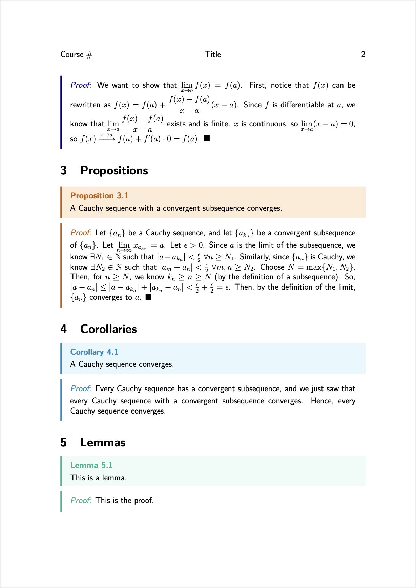
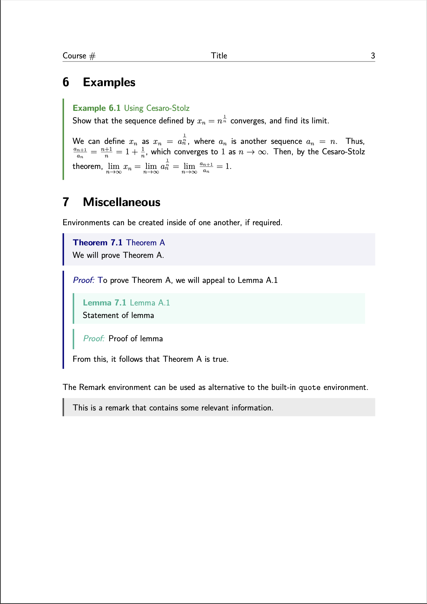

# $\LaTeX$ Lecture Notes Template

Simple lecture notes template with colored boxes, focused on Mathematics.

### Info

-   Includes boxes for Theorems, Propositions, Corollaries and Lemmas (with proofs), and Definitions and Examples - defined in [`boxes.sty`](https://github.com/xAngad/latex-lecture-notes/blob/main/packages/boxes.sty)
-   Handles header imports, document setup, and shortcuts (like `\Q` for $\mathbb{Q}$ and `\R` for $\mathbb{R}$ etc. - defined in [`general.sty`](https://github.com/xAngad/latex-lecture-notes/blob/main/packages/general.sty)
-   Also in the repository is [`Lecture Notes Template.tex`](https://github.com/xAngad/latex-lecture-notes/blob/main/Lecture%20Notes%20Template.tex) containing use cases for all the environments, and some of the shortcuts.

### Usage

> Can be used in VSCode by installing the [`LaTeX Workshop`](https://marketplace.visualstudio.com/items?itemName=James-Yu.latex-workshop) extension.

All modules follow a similar pattern:

-   Definitions: `\begin{definition}{<name>}{<ref tag>} ... \end{definition}`
-   Theorems:
    -   Statement: `\begin{theorem}{<name>}{<ref tag>} ... \end{theorem}`
    -   Proof: `\begin{tproof*}{<name>}{<ref tag>} ... \end{tproof*}`
-   Corollaries:
    -   Statement: `\begin{corollary}{<name>}{<ref tag>} ... \end{corollary}`
    -   Proof: `\begin{cproof*}{<name>}{<ref tag>} ... \end{cproof*}`
-   Propositions:
    -   Statement: `\begin{proposition}{<name>}{<ref tag>} ... \end{proposition}`
    -   Proof: `\begin{pproof*}{<name>}{<ref tag>} ... \end{pproof*}`
-   Lemmas:
    -   Statement: `\begin{lemma}{<name>}{<ref tag>} ... \end{lemma}`
    -   Proof: `\begin{lproof*}{<name>}{<ref tag>} ... \end{lproof*}`
-   Examples: `\begin{example}{<name>}{<ref tag>} ... \end{example}`

_(the `*` prevents proofs from being numbered - remove if required)_

### Screenshots

